# 在Microsoft Office中启用flash内容

> 本文转载自[2-2-3-trimethylpentane](https://forum.smart-teach.cn/u/2-2-3-trimethylpentane)发布在[STCN论坛](https://forum.smart-teach.cn/)上的文章：[【教程】Microsoft Office启用flash内容](https://forum.smart-teach.cn/d/310)，转载已获得[原作者授权](https://github.com/TEHS-TECH/CN-e-learning/issues/15#issue-3484354303)。以下是原文的转载授权信息：
>> 本文中的注册表文件、教程及部分插图来源于[@AlanCRL](https://forum.smart-teach.cn/u/AlanCRL)大佬，已获得许可使用，十分感谢他🤝。
原教程地址：https://blog.csdn.net/alan16356/article/details/147173208?fromshare=blogdetail&sharetype=blogdetail&sharerId=147173208&sharerefer=PC&sharesource=alan16356&sharefrom=from_link

> 如无特殊说明，下文中的“本人”均指[2-2-3-trimethylpentane](https://forum.smart-teach.cn/u/2-2-3-trimethylpentane)。

## 一、引言
自2020年12月31日Adobe正式终止对Flash的技术支持以来，这项曾风靡全球的交互技术已逐渐退出历史舞台。然而在教育、企业培训等特定场景中，仍有大量基于Flash开发的课件因历史遗留问题继续服役。并且MSO目前已默认禁用Flash，会导致这类幻灯片课件的flash内容显示为图片或空白。本文将针对这类问题提出一系列解决方案。

### 本教程适用范围：Microsoft Office 2016⁓365

## 二、安装Flash
**请不要重复安装下列两个软件，否则可能会导致未知错误！！！**

### 方法一、Clean Flash Player（推荐使用）

> 此方法摘自本人之前的帖子：https://forum.smart-teach.cn/d/307

#### 下载地址
建议优先选择GitLab镜像源以规避网络问题：
- **GitLab（推荐）**  
  https://gitlab.com/cleanflash/installer/-/releases/34.0.0.325  
  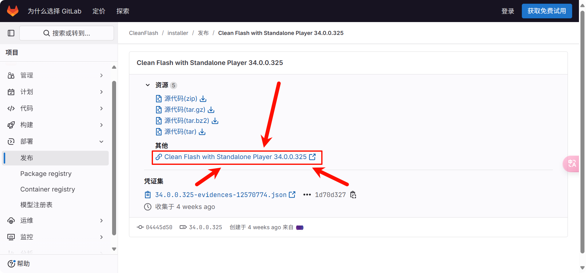
- **GitHub（备用）**  
  https://github.com/TCOTC/CleanFlash_Installer/releases  
  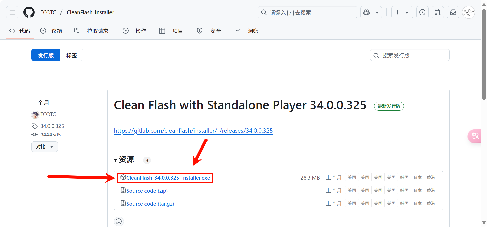

#### 安装教程
1. **协议确认**  
   勾选许可协议复选框 → 点击"Agree"  
   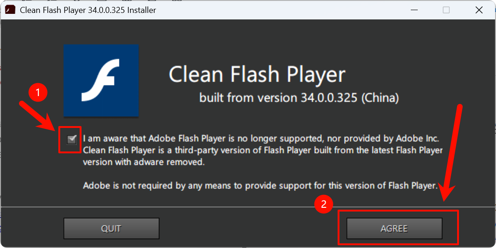

2. **组件选择**  
   全选三个功能模块 → 点击"Next"  
   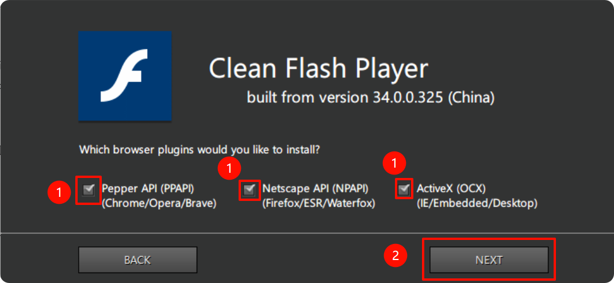

3. **快捷方式**  
   按需选择 → 点击"Next"  
   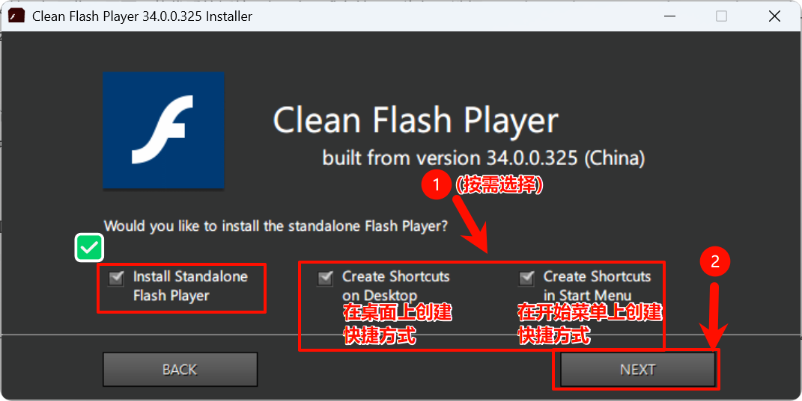

4. **版本选择**  
   忽略调试版选项 → 直接点击"Next"  
   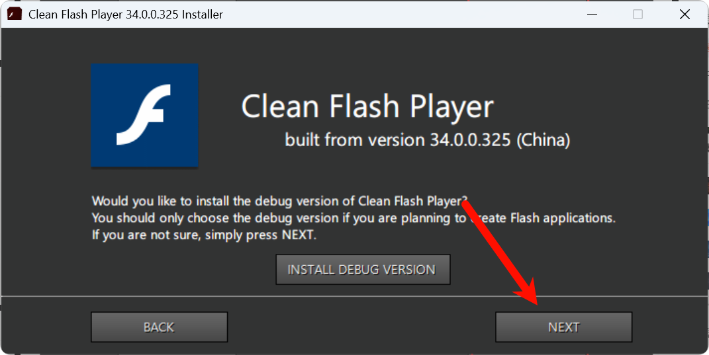

5. **完成安装**  
   点击"Install"执行安装 → 完成后点击"Quit"退出
   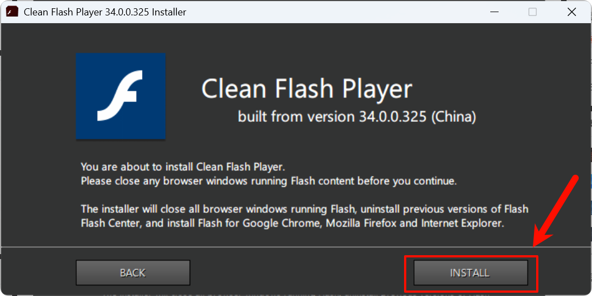  
   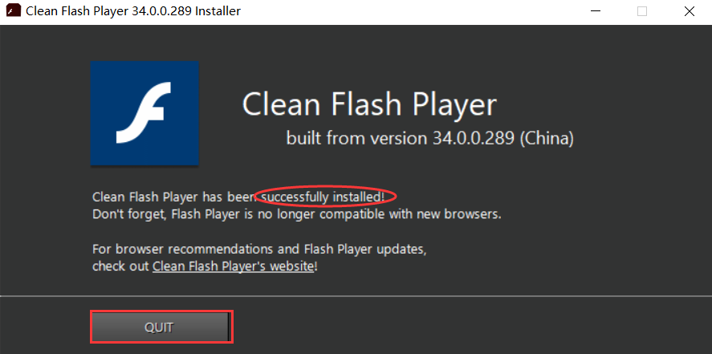

### 方法二、Flash官网（中国版）

**请先看完下方图例，再下载！！！**

打开这个网址：
https://www.flash.cn/download-wins
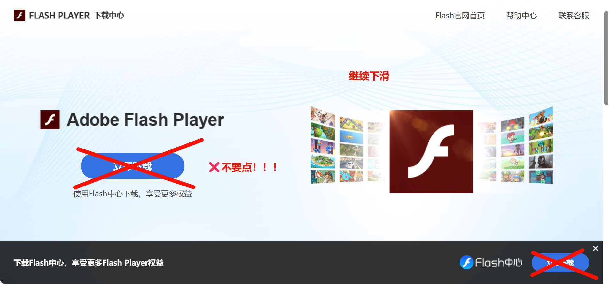

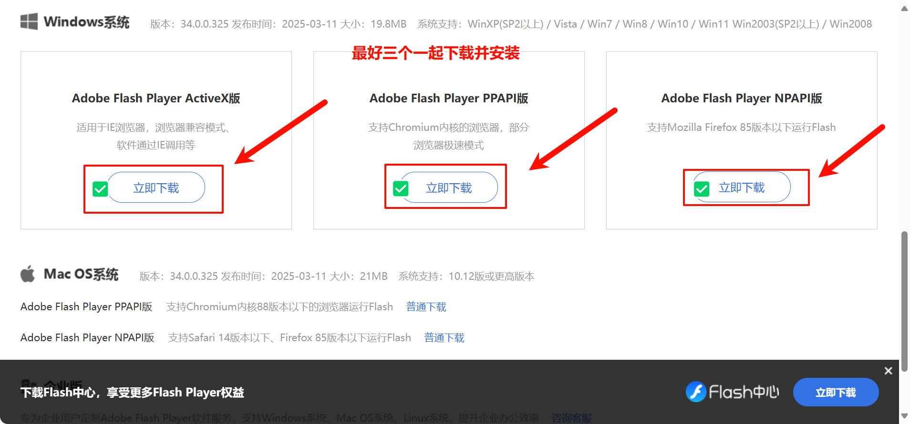

---

## 三、导入注册表

下载这个压缩包：https://www.123912.com/s/duk9-wkQAd

打开压缩包，**依次**将**三个都**合入注册表。

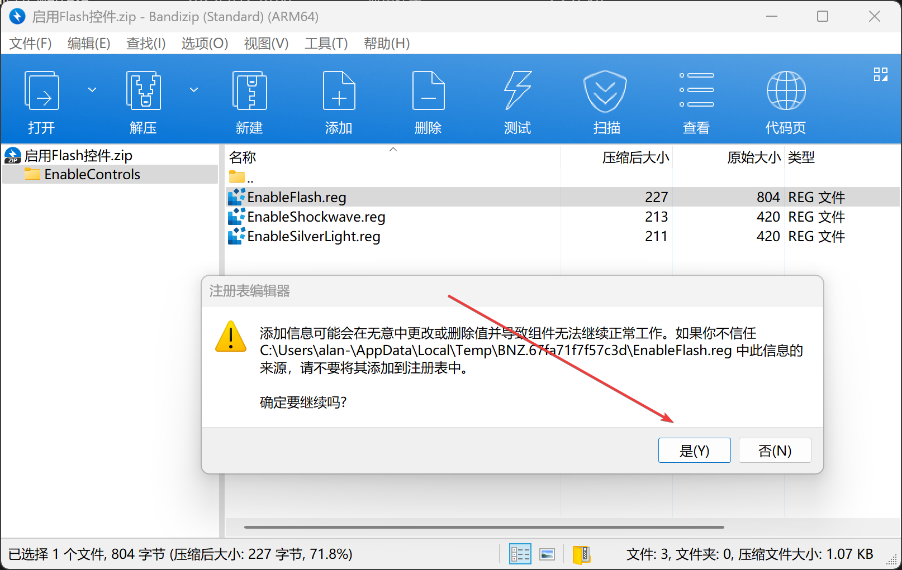

如果不出意外的话，您的Office打开含flash的幻灯片时就会出现这个提示。

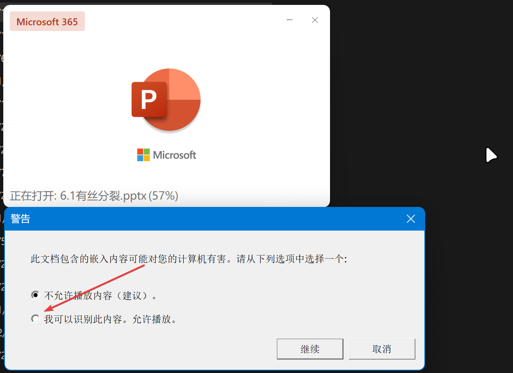

勾上 **“我可以识别此内容。允许播放”** 并点击继续。

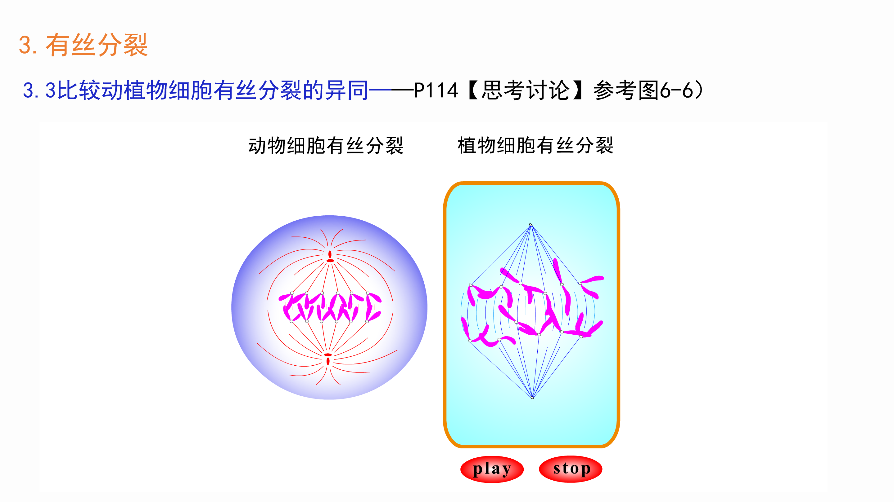

很好，这样您的flash已经成功动起来了！