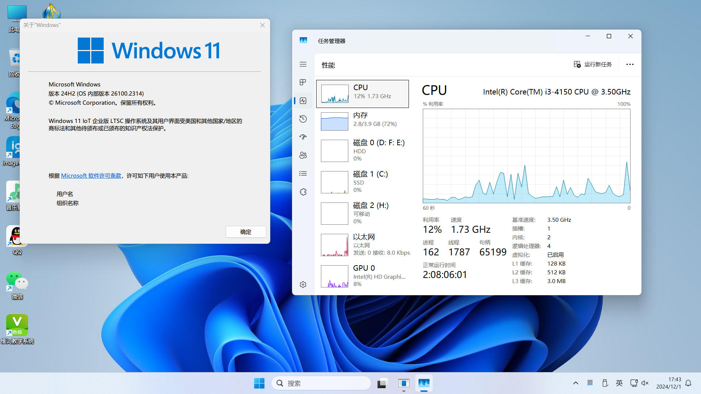
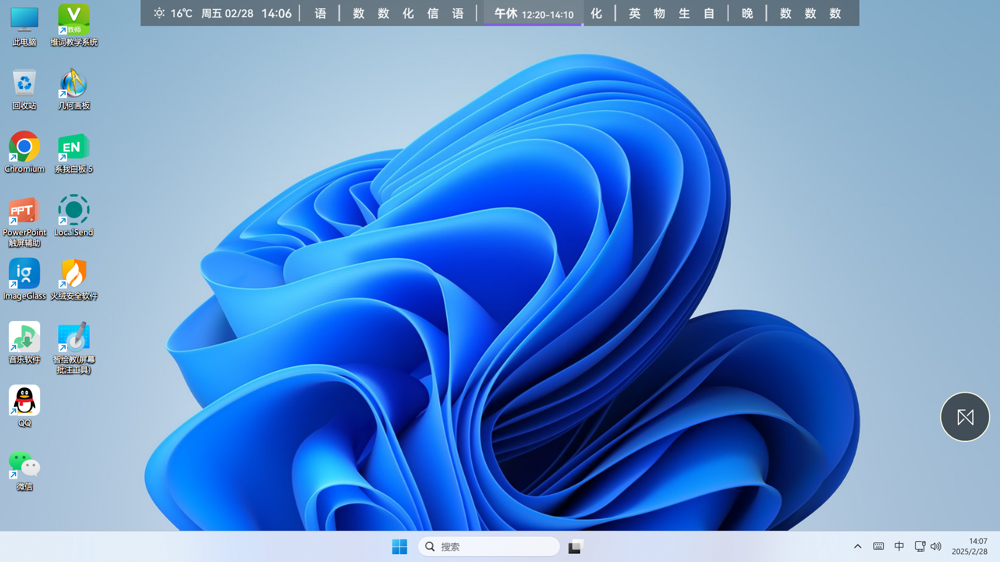
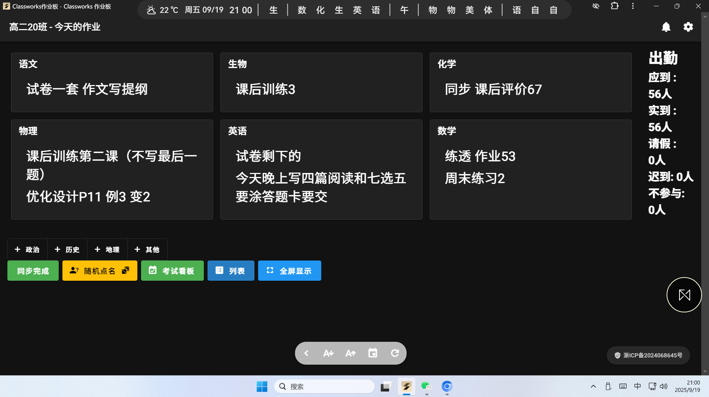

# 成都航天中学

### 学校名称

成都航天中学

### 学校位置

四川省成都市龙泉驿区车城西四路366号

### 学校类型

完全中学

### 信息中心位置

未知

### 班级大屏类型

其他

### 班级大屏品牌

鸿合

### 班级大屏型号

HD-I8035E

### 班级大屏操作系统

部分Windows 7旗舰版与部分Windows 10专业版混装

### 冰点还原

有

### 补充信息

本校为PC外接大屏，有键盘，使用VGA传输画面。部分是较新的鸿合大屏和旧款希沃大屏，型号未探明。使用多媒体控制器硬切换展台/电脑，展台为鸿合老式视频展台。实验楼部分使用日立投影仪+鸿合投影机用白板
学校电脑大多使用分辨率为1024x768（屏幕可用最高且最推荐分辨率为1920x1080），看着显示画面较扁，Windows 7设备存在因驱动而导致的音质低问题，已探明不是硬件问题。教学体验偏差。
教室大多数电脑配置：
CPU信息：Intel Core i3-4150
运行内存：4GB
硬盘：C盘用的是金士顿固态硬盘，D盘是机械硬盘。存储空间充裕。
冰点还原：老版本Deepfreeze，密码可用Meltdown破解，已探明全校通用冰点管理密码为jsg123。

### 备注

老师总体来说较为支持Aiwb上的优质项目，但我个人精力有限，不想去其他班冒着社死风险瞎弄。
部分同学较为顽固守旧，出现“能用就行了，安排那么多高级的东西干什么”的心理。
技术员有点技术但不多，请见https://forum.smart-teach.cn/d/670
本人班上使用Windows 11 LTSC，总体体验良好。以下为部分实装图片（可能较旧）：

